# OpenGL-Rendering

|     Task     |   Description   |
|:------------:|:---------------:|
| Frustum Manipulation | Changed camera perspective, increased triangle count, and adjusted clipping to better visualise the frustum. |
| Rotation Matrix   | Applied x-axis rotation using `mat_motion` with `Math.PI/2`, changing object orientation.  |
| Phong Shading             | Implemented Phong lighting model to calculate realistic specular highlights. |
| Fragment Z Coordinate Shading           | Used `gl_FragCoord.z` to map fragment depth into grayscale, visualising depth variation across the surface. |
| Adding Random Noise to Vertices      | Added random noise to vertex normals to distort surface appearance without affecting overall shape. |
| Points vs Lines Primitives | Switched triangle rendering to points and lines by changing `gl.drawElements` mode, showing different primitive representations. |
| Blinn - Phong Reflection             |  Replaced Phong reflection with Blinn-Phong using a halfway vector to compute specular highlights. |
| Texture Coordinate Mapping and UV Influence | Used UV coordinates to assign texture colors to the model, revealing how spatial mapping affects appearance. |
| Depth Testing and Skybox Optimisation | Disabled depth testing to correctly render the skybox behind scene objects and remove occluded fragments. |
| Texture Filtering and Sampling Artifacts | Compared bilinear/mipmap filtering with nearest-neighbour sampling, highlighting effects on texture smoothness and aliasing.  |
| Per-Vertex vs Per Fragment (Gouraud Shading)   | Implemented per-vertex (Gouraud) shading, resulting in visible interpolation artifacts compared to per-fragment shading. |

## Frustrum Manipulation
In this task, the camera perspective was changed by adjusting the `eye` vector, and the number of triangles was increased to 1000. Additionally, rendering of the triangles was removed to clearly expose the shape and boundaries of the frustum. These changes allow for a more accurate and detailed visualisation of the viewing volume, as seen in the three output canvases.

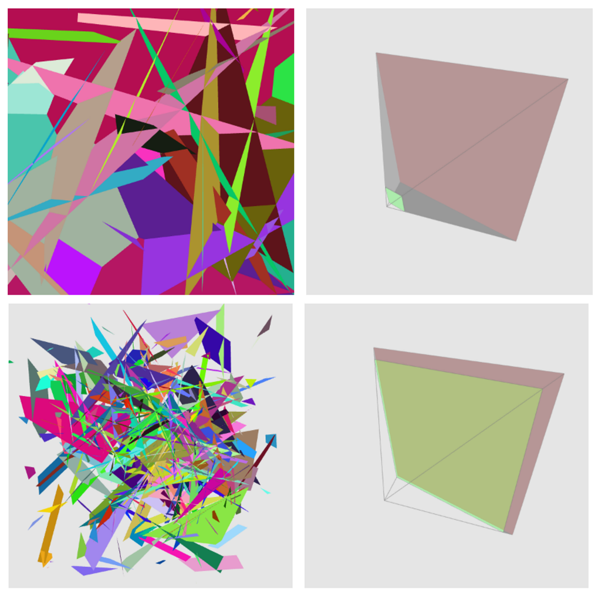

## Rotation Matrix 
Created a rotation matrix using `mat_motion`, where the object was rotated on the x-axis using an angle of `Math.PI/2` (90 degrees). This changed the view through continuous theta increments, resulting in different object orientations as visualised in the screenshots.

  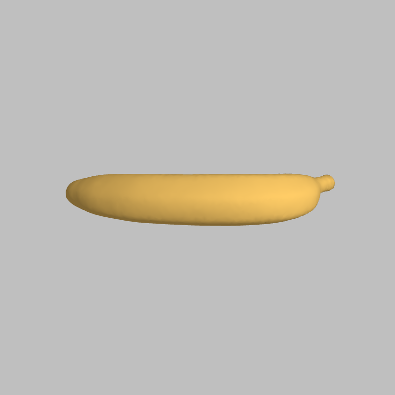
  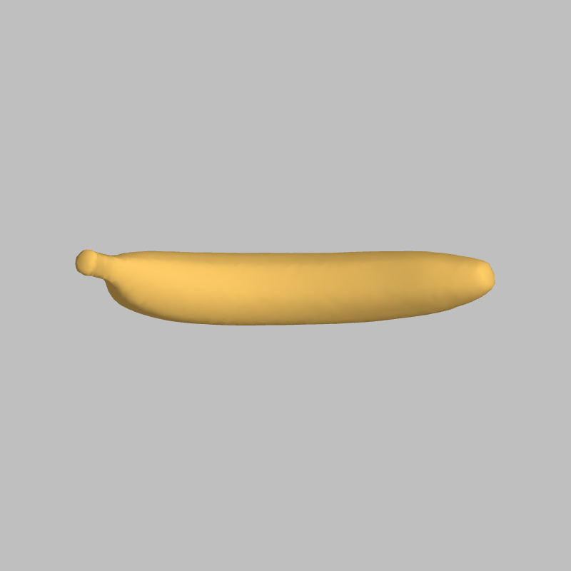

## Phong Shading
In this task, I implemented the Phong reflectance model by calculating the specular term using the surface normal, light direction, and reflection vector. This enhanced the lighting by adding realistic specular highlights, based on material properties and light positioning.

  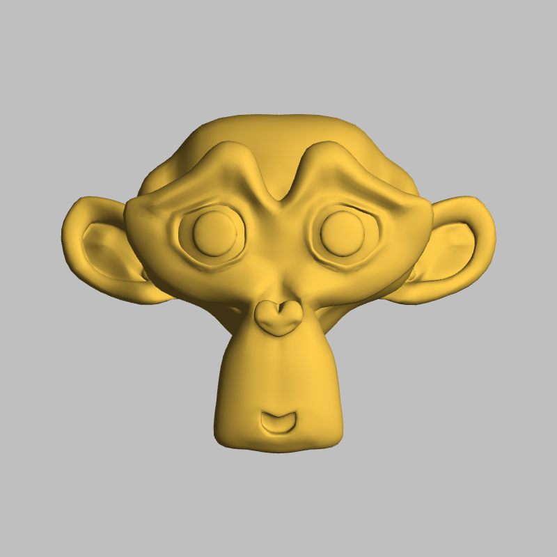
  

## Fragment Z Coordinate Shading
In this task, I accessed the fragment's depth value using `gl_FragCoord.z` and applied a linear transformation to normalize it to a 0–1 range. I inverted the result to better highlight depth differences and passed this normalized value to all RGB channels in `gl_FragColor`, producing a grayscale depth visualization. The result appears smoother than previous outputs, likely due to using triangles instead of points or lines, which ensures more continuous interpolation between fragments.

  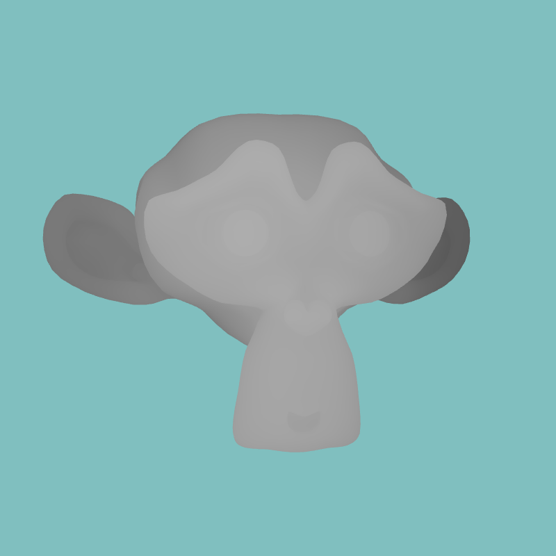

## Adding random noise to Vertices
In this task, I added random noise to the mesh’s vertex normals, which altered how the surface interacts with light without changing the actual geometry. This caused the surface to appear bumpy or warped, while the overall shape and outline of the model remained smooth and intact. I also compared this to applying noise directly to vertices, which distorts the entire silhouette. The code snippet shows how the normals were perturbed using a small random factor.

  
  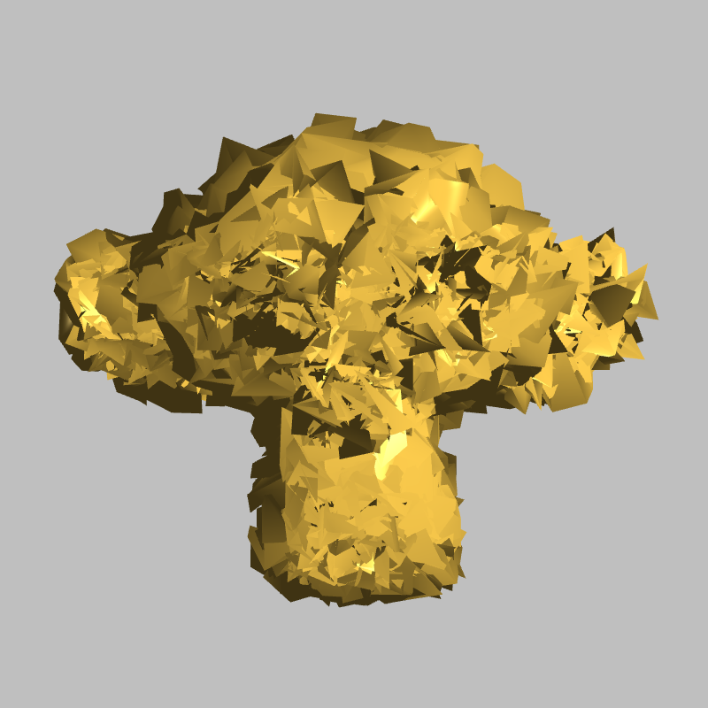
  

## Points vs Lines Primitives
In this task, I explored different primitive types by modifying the parameters of the `gl.drawElements` function. I replaced triangle rendering with `gl.POINTS` and adjusted `gl_PointSize` to visualize individual vertices on the mesh. For the second variation, I used `gl.LINES` instead, which connected vertices and emphasized the edges. This allowed for direct comparison between dot-based and edge-based representations of the mesh geometry.

  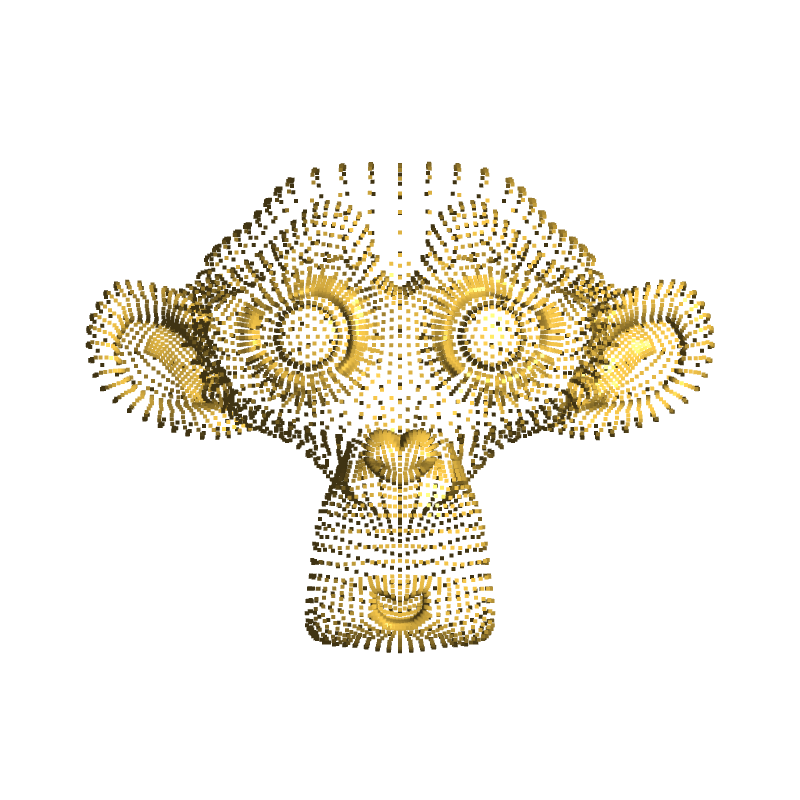
   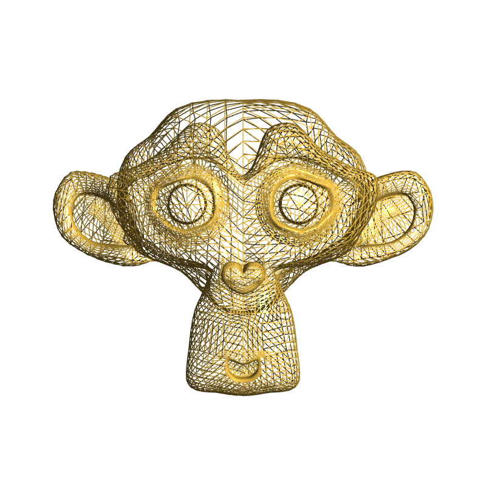

## Blinn - Phong Reflection
For this task, I modified the existing Phong shading algorithm by implementing the Blinn-Phong reflection model. This involved calculating a new halfway vector `h` using the sum of the light and view directions. The specular component was then computed using this vector, avoiding the need to calculate the reflection vector `r`. This approach changes how highlights appear and can be more efficient. The updated calculation is shown in the code snippet and reflected in the output render.

  
  

## Texture Coordinate Mapping and UV Influence
In this task, I implemented texture mapping by assigning each fragment a color based on UV coordinates (`s` and `t`) using `gl_FragColor`. These coordinates determine which part of the texture image is sampled. For example, the head appears darker because its UVs map to the lower-left of the texture, which contains darker pixels. This contrast with the brighter torso area—mapped to higher `s` and `t` values—is clearly shown in the cow texture image. The code snippet demonstrates how these UV values were used to form the final color.

  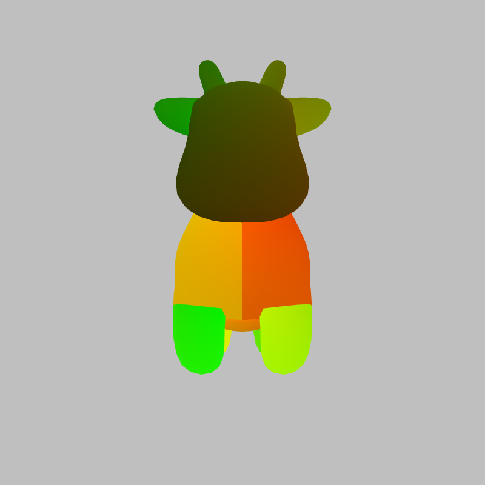
  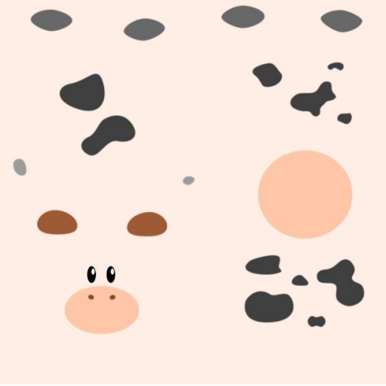

## Depth Testing and Skybox Optimisation
In this task, I explored the effect of enabling and disabling depth testing while rendering a skybox. By disabling `gl.DEPTH_TEST`, the skybox was drawn behind all other objects, ensuring that no fragments unnecessarily overdraw scene geometry. This technique helps avoid rendering issues where the background appears in front of objects and optimizes performance by discarding out-of-depth fragments. The difference is visible in how the cow model remains in front of the background when depth testing is handled properly.

  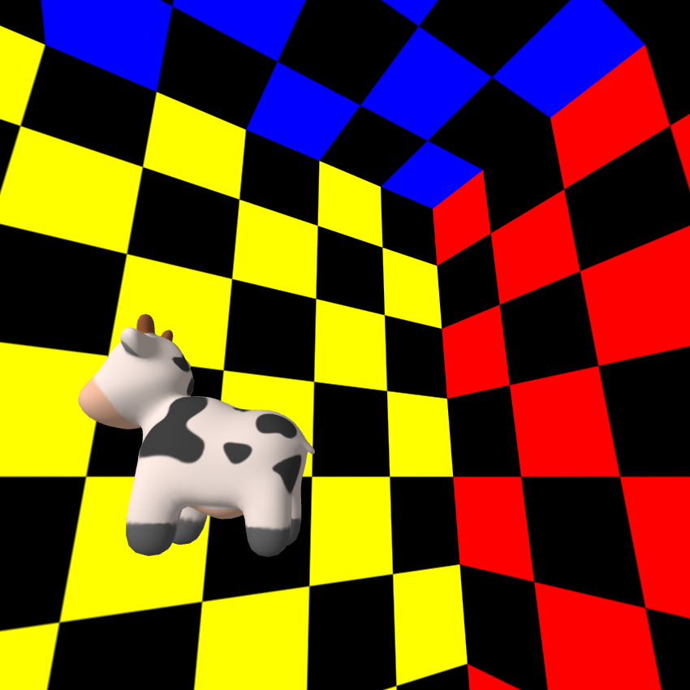
  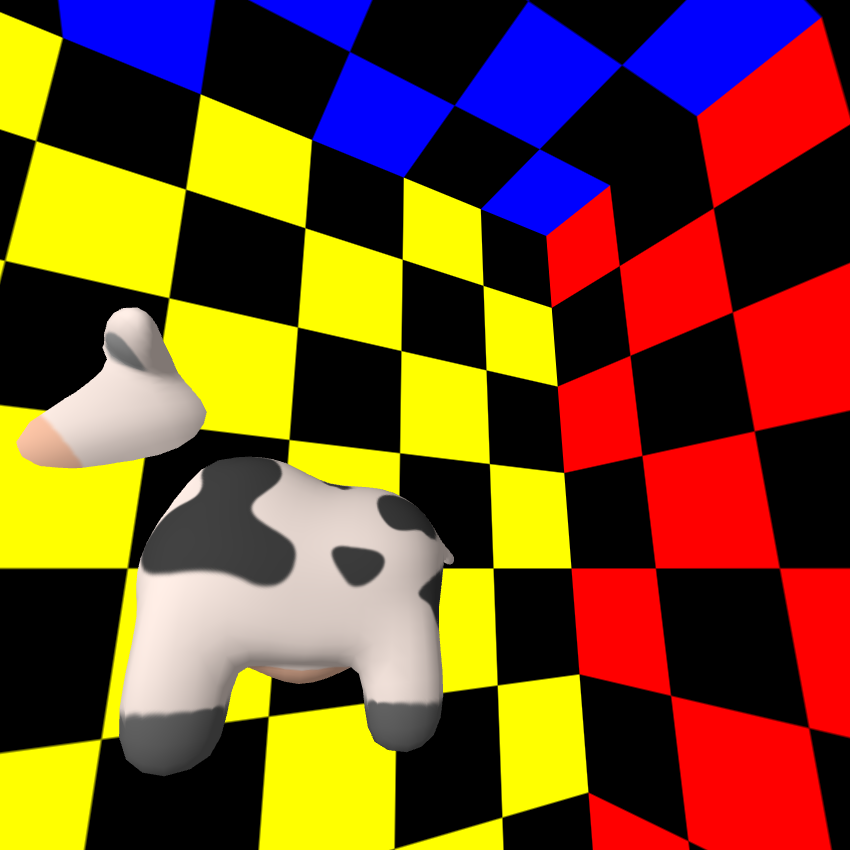

## Texture Filtering and Sampling Artifacts
In this task, I investigated how different texture filtering methods affect the final rendered output. By modifying the `gl.texParameteri` settings, I compared bilinear/mipmap filtering with nearest-neighbour sampling. The nearest-neighbour approach resulted in visible aliasing due to sharp transitions and pixelation, especially when a large texture was reduced into a small screen space. In contrast, bilinear/mipmap filtering produced a smoother appearance by blending texels, which, while slightly blurred, is visually more appealing. This comparison highlights the importance of interpolation when textures are minified or magnified on a 3D surface.

  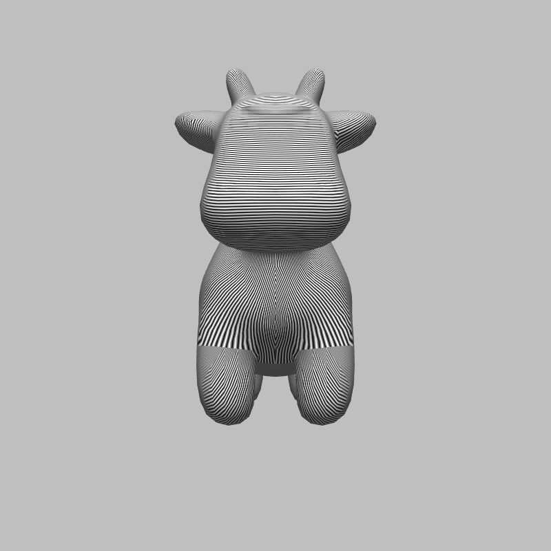
  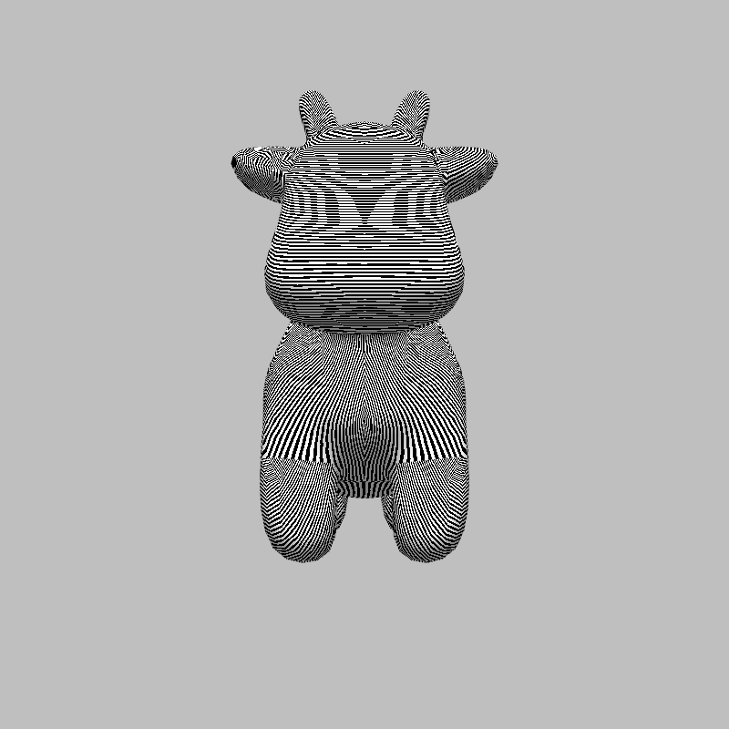

##  Per-Vertex vs Per Fragment (Gouraud Shading) 

  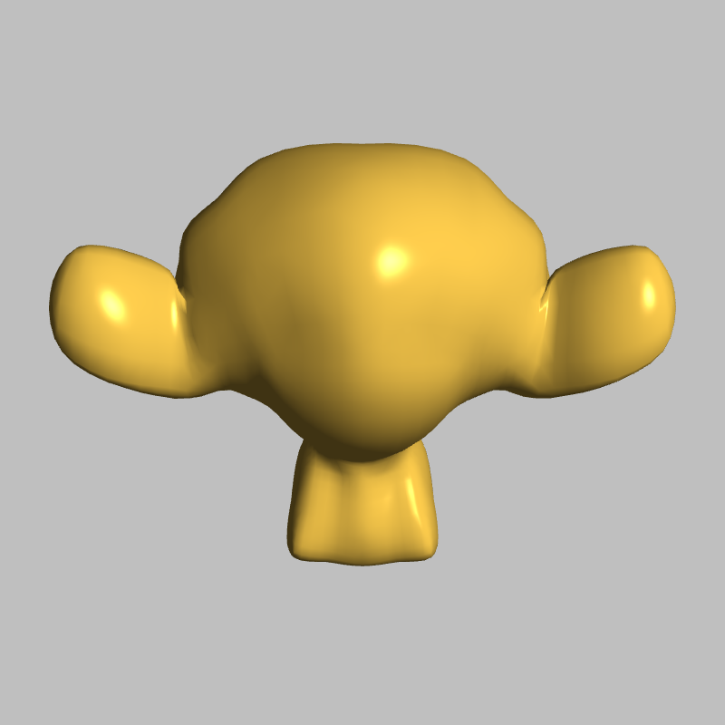
  

